# Architecture: distilling a 500K-row reasoning dataset and fine-tuning Qwen3.8-27B on it

This document explains **how the large-scale cricket pipeline is built and why**: the systems involved, every stage
from the raw ball-by-ball file to a published dataset and adapter, the code that runs at each step, and how each
stage is evaluated and validated. Diagrams are Mermaid (rendered by GitHub, Hugging Face, VS Code and most Markdown
viewers).

Companion documents: [`DATASET.md`](DATASET.md) (the source data), [`README.md`](README.md) (runbook, measured
numbers - Part II §12-§14 for this pipeline).

**Status (2026-10-07)**

| stage | status |
|---|---|
| distillation of the 500K-row dataset | **done** - 500,000 verified rows, all 425,119 source rows covered, published as [`Balab2021/CricketData-T20-Reasoning-Qwen3.8-Full`](https://huggingface.co/datasets/Balab2021/CricketData-T20-Reasoning-Qwen3.8-Full) |
| fine-tuning on it (32 GPUs) | **running** since 2026-10-07 05:58 on 8 batch-spx nodes as 12 chained 1-hour chunks (≈ 6.2 h of training, §4.4); merge, evals and the adapter push follow automatically |
| the same training/eval code at small scale | **done** in Part I (4,500 rows, 16 GPUs) - README §1 |

---

## 1. System context

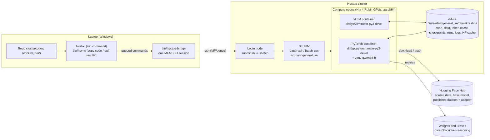

| layer | what | why |
|---|---|---|
| laptop | code is edited here; `bin/hsync` copies it to `clustercodes/code/` on Lustre (refuses CRLF files) | Hecate login needs MFA every time; one long-lived bridge session lets scripted commands run without re-authenticating |
| login node | `cricket/submit.sh <stage>` builds `sbatch` calls with the right container, nodes, time and dependencies | every stage is a batch job (no compute on the login node) |
| compute | whole nodes (`--exclusive`): 4 Rubin GPUs (279.5 GiB each), 2 Vera CPUs, 1.43 TB RAM, 8 × 800 Gb/s InfiniBand | GPUs are not SLURM GRES here - a job owns full nodes |
| containers | **PyTorch image + venv** for data prep, training, merging, reporting, pushing; **vLLM Rubin image** for all generation (distillation and evals) | vLLM's own image is the only one whose Triton compiles for sm_107 (README §10); training libs live in the venv |
| storage | everything a job reads or writes is on Lustre; jobs start in `/home/bbalakreshna` | home is small; Lustre is shared by all nodes |
| services | Hugging Face (inputs and outputs), W&B (all metrics) | |

## 2. End-to-end pipeline

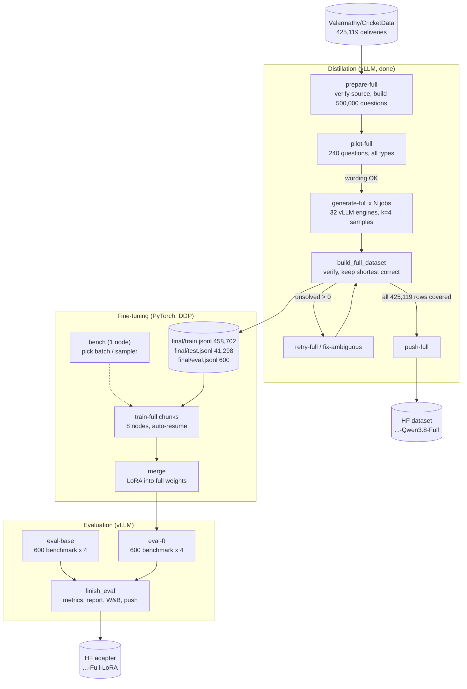

Every box is one SLURM job (or a chain of identical resumable jobs); arrows are SLURM dependencies (`afterok`,
`afterany`) or human review gates. Each stage writes its outputs to Lustre before the next one starts, so any stage
can be rerun on its own.

---

## 3. Distillation

### 3.1 From a source row to a verifiable question (`prepare.py --mode full`, `cricket_qa.build_full`)

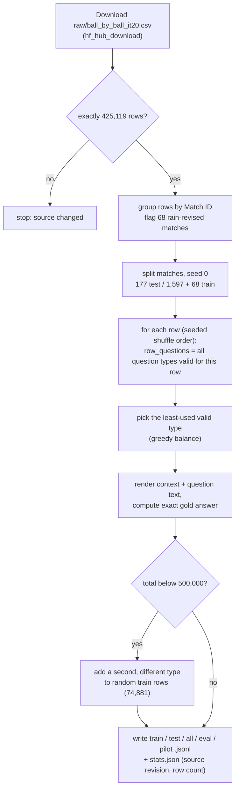

Validity rules per type (`row_questions`): overs-based types need `0 ≤ Balls Remaining ≤ 120` and at least one legal
ball; `chase_rate` is never asked in rain-revised matches and, in innings 1, only if the innings lasted 20 overs;
`projection` only in innings 1; `milestone` needs the striker to have scored; `strike_rate` needs a ball faced;
`legal_balls` is the fallback for the 40 rows where nothing else is defined (innings opened by a wide / no-ball).

Question anatomy (real example, row 55,565):

```
[system] You are a cricket analyst. Work through the problem step by step, then give the final answer
         on its own line as 'Final answer: <number>'.
[user]   T20 International: Bulgaria v Serbia at Lisicji Jarak Cricket Ground, 2022-07-08.
         Bulgaria are batting first. After 6.0 overs (cricket notation: overs.balls) they are 34/2.
         KC D'Souza is on 8 off 8 balls and H Lakov is on 13 off 17. A Mene-Ejegi bowled the last delivery.

         What is Bulgaria's current run rate in runs per over? Round to 2 decimal places.
gold     5.67   (= round(34 * 6 / 36, 2); 36 = 120 - Balls Remaining 84)
```

The context deliberately includes distractors (non-striker, bowler, venue) and cricket notation; the gold answer is
computed only from the row's own numbers, so every question is checkable.

### 3.2 Generation job anatomy (`vllm.sbatch` + `gen_vllm.py`)

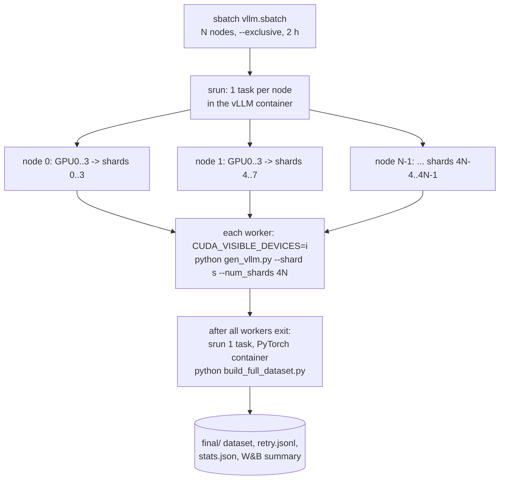

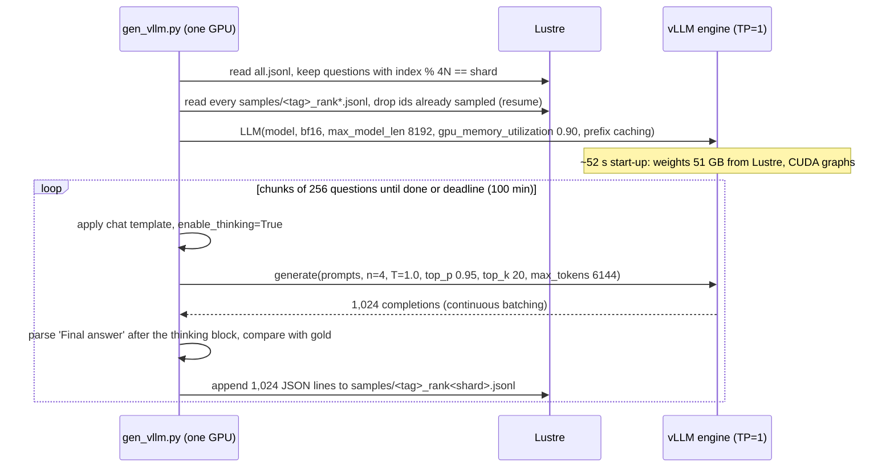

**Why data parallel, one engine per GPU:** the bf16 model (51 GB) fits one 279.5 GiB GPU with ~200 GiB left for KV
cache; Qwen3.8's Gated-DeltaNet layers keep fixed-size state, so hundreds of sequences fit. Independent engines need
no inter-GPU communication, scale linearly (measured 8,238 ± 2% tok/s on each of 32 GPUs), never hit NCCL timeouts,
and can be resumed with any node count.

### 3.3 Verification and selection (`cricket_qa`, `build_full_dataset.py`)

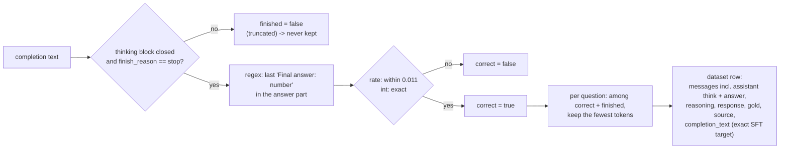

`build_full_dataset.py` streams all sample files once (2.0 M lines, 4.7 GB), keeps only the best trace per question in
memory, and writes the dataset only when **no question is pending**. It also writes `retry.jsonl` (questions with no
correct sample) and `final/uncovered_rows.jsonl` (source rows with no row at all).

### 3.4 Quality gates and recovery loops

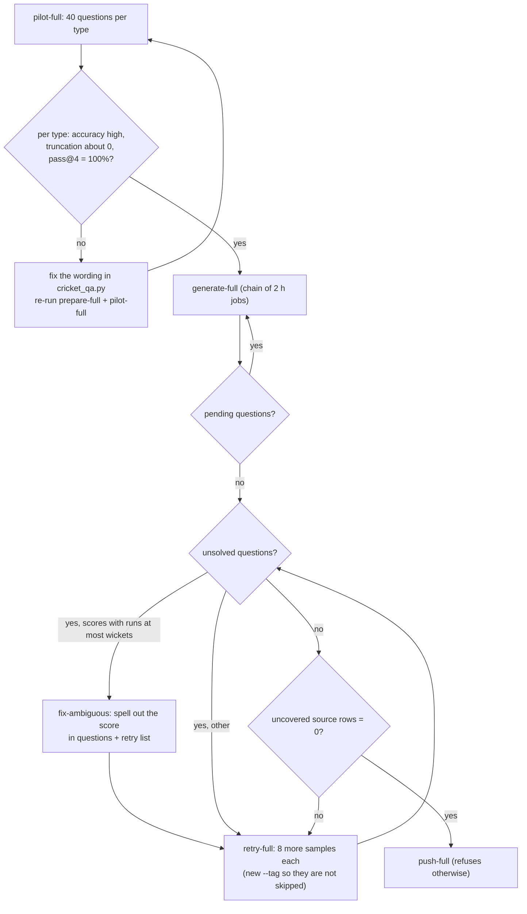

What actually happened in the reference run: the pilot exposed the *projection* wording (10% truncated → fixed to
0.6%); the main pass left 87 questions unsolved, all with runs ≤ wickets scores (Australian notation ambiguity) -
`fix-ambiguous` + one retry solved all 87; the push gate had refused once before that (63 uncovered rows).

### 3.5 Distillation job graph (reference run)

```mermaid
flowchart LR
  a["696975 prepare-full"] --> b["696976 pilot-full"]
  b --> c["697019 datagen-full<br/>8 nodes, 1:42:51"] -->|afterany| d["697021 datagen-full<br/>tail, 8:20"] -->|afterany| e["697178 datagen-full<br/>buffer, 1:54"]
  e -->|afterok| f["697022 retry-full<br/>1 node"] -->|afterok| g["697023 push-full<br/>REFUSED: 63 uncovered"]
  g -.-> h["700650 fix-ambiguous"] --> i["700651 retry-full tag retry2"] --> j["700652 push-full<br/>pushed"]
```

Totals: 2,002,672 samples, 1,581,921,168 generated tokens, ≈ 15.4 node-hours (62 GPU-hours). Details and
per-type quality: README §12.

### 3.6 Data lineage of one row

| stage | artifact | the example (row 55,565) |
|---|---|---|
| source | CSV row | match 1323550, innings 1, over 6 ball 6, Innings Runs 34, Wickets 2, Balls Remaining 84 |
| question | `questions-full/all.jsonl` | id `1323550-1-55565-run_rate`, gold 5.67, `split: train` |
| samples | `samples/train_rank*.jsonl` | 4 completions, all correct; shortest = 198 tokens |
| dataset row | `final/train.jsonl` | `reasoning` "…34 / 6 = 5.666... = 5.67…", `response` "…Final answer: 5.67", `completion_text` = exact model output |
| published | HF `data/train-0000k.jsonl` | same row without `completion_text` |
| SFT input | token cache `tok-*.npz` | prompt tokens (masked, label −100) + completion tokens + `<|im_end|>` (trained) |

---

## 4. Fine-tuning on the large dataset

### 4.1 Job chain (`submit.sh train-full`)

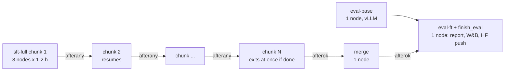

* `afterany` between chunks: a chunk that hits its time limit, is pre-empted or fails still lets the next one resume
  from the newest checkpoint. The last chunk must succeed (`afterok`) for the merge to run.
* Chunks are short (1-2 h) because 8-node gaps of that length appear far more often than 5-hour ones on a busy queue
  (README §13.6). Settings: `TRAIN_NODES`, `TRAIN_TIME`, `TRAIN_MIN` (stop-new-steps minute), `TRAIN_CHUNKS`,
  `SAVE_STEPS`, `PARTITION` (e.g. `batch-xdr,batch-spx`: start wherever it fits first).
* `eval-base` has no dependency and runs immediately; it scores the untouched base model on the same 600 questions.

### 4.2 Inside one training job (`job.sbatch` + `train.py`)

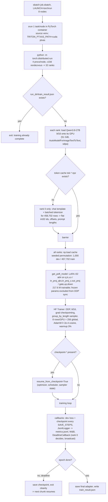

Key implementation choices:

| choice | detail | reason |
|---|---|---|
| plain DDP, full replica per GPU | 51 GiB of frozen bf16 weights per GPU | fits easily; only LoRA gradients (0.87 GB fp32) cross the network |
| skip DDP's initial broadcast | `_ddp_params_and_buffers_to_ignore` = all frozen params | every rank loads identical weights from Lustre; avoids broadcasting 51 GB |
| loss on the completion only | labels = −100 on the prompt tokens | the model learns to produce the reasoning and answer, not to repeat the question |
| target = exact model output | `completion_text` + `<|im_end|>` with the same thinking-mode prompt | self-distillation: the fine-tuned model reproduces its own best (shortest correct) behaviour |
| token cache | rank 0 tokenizes once into `cricket/cache/tok-<dataset>-<size>-<mtime>-L<max_len>-n<limit>.npz` | 32 ranks would otherwise each tokenize 458K rows; the key changes if the data file changes |
| length-grouped batches | `train_sampling_strategy="group_by_length"` | ~2.4× throughput with batch 8 vs the Part I settings; the longest batch comes first, so OOM shows up at step 1 |
| deadline callback | rank 0 compares time with the job deadline and **broadcasts** the decision | all ranks stop on the same step (no NCCL hang), save, exit |
| completion guard | `train_result.json` written only after the full epoch | resume jobs after completion exit immediately |
| NCCL timeout | 2 h | rank 0 tokenization and uneven work never trip the watchdog |

### 4.3 One optimizer step

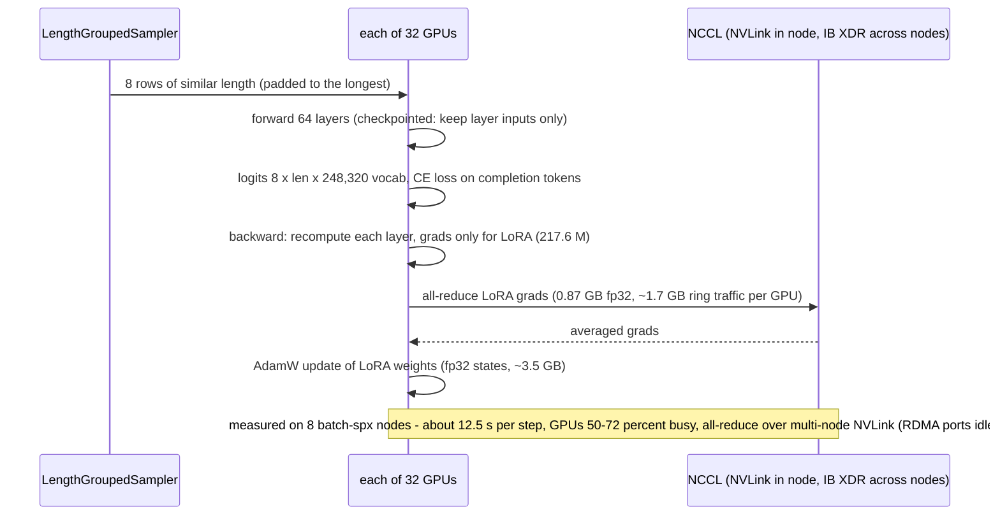

### 4.4 Live run measurements (chunk 1, job 711070, 2026-10-07)

Measured ~20 min into training on 8 `batch-spx` nodes (hecate0325, 0328, 0334, 0336-0338, 0340, 0341 - all in NVLink
block 19) with `tools/measure_job.sh` and `tools/net_sample.sh`:

| quantity | measured |
|---|---|
| token cache build (rank 0, 458,702 rows) | 377 s; 457,689 train + 1,000 dev rows, 13 rows over 6,144 tokens dropped, mean 686 tokens |
| step time | **≈ 12.5-13 s** per step of 256 rows (steps 30-100) → ≈ 0.62 rows/s per GPU, about half the 1-node benchmark (1.14) |
| projected training time | 1,788 steps × 12.5 s ≈ **6.2 h** → run as 12 chained 1-hour chunks (~220 steps each) |
| GPU utilization | 49-72% (mean ≈ 58%) on all 32 GPUs |
| GPU memory | 129-277 GiB of 279.5 GiB (varies with the length group in flight) |
| GPU power / clock | 630-760 W (limit 2,300 W); SM clock 2,415-2,419 MHz (at max) |
| InfiniBand / Ethernet (RDMA) ports | **0 GB/s** - the spx nodes' RDMA ports (Ethernet / Spectrum-X) are idle |
| NVLink | **≈ 8.3 GB/s transmit per GPU** (all links) - NCCL all-reduces across nodes over the multi-node NVLink fabric |
| loss | train ≈ 0.315-0.323 from the first steps (the data is the model's own output, so loss starts low); dev loss 0.326 at step 100 |

Open question for tuning: 8.3 GB/s per GPU is far more traffic than the LoRA gradient all-reduce alone needs
(≈ 1.7 GB per GPU per step ≈ 0.14 GB/s), and the step time is ~1.8× the single-node benchmark. Candidates to profile
next: what DDP/NCCL actually reduces per step (e.g. with `NCCL_DEBUG=INFO` and a torch profiler trace), and multi-node
vs single-node scaling at the same per-GPU batch.

### 4.5 Sizing (benchmarked, README §13.2)

| quantity | value |
|---|---|
| rows / tokens | 457,702 training rows, mean 700 tokens (~220 prompt + ~464 reasoning + answer), max 6,144 |
| steps | 1 epoch ≈ 1,788 at global batch 256 |
| throughput | benchmark (1 node): 1.14 rows/s per GPU → 3.4 h on 32 GPUs; **measured on 8 nodes: ≈ 0.62 rows/s per GPU → ≈ 6.2 h** (§4.4) |
| rejected settings | batch 16 (OOM: ~98 GB of fp32 logits for 16 × 6,144 × 248,320), no gradient checkpointing (OOM) |
| memory per GPU | weights 51 GiB + LoRA states 3.5 GB + checkpointed activations + up to ~98 GB transient logits (fits 279.5 GiB) |

---

## 5. Evaluation

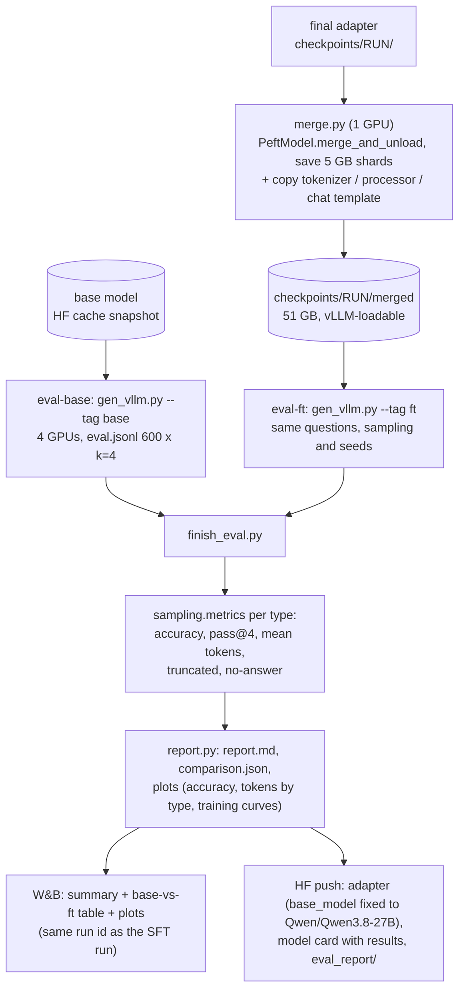

| metric | definition |
|---|---|
| accuracy | correct samples / all samples (avg over k = 4 per question) |
| pass@4 | questions with at least one correct sample / questions |
| mean tokens | generated tokens per sample (reasoning + answer) - the efficiency metric |
| truncated rate | samples that hit `max_tokens` before `</think>` + answer |
| improved / regressed | questions whose share of correct samples went up / down from base to fine-tuned |

The benchmark is the fixed 600-question `eval.jsonl` (200 per original type, 177 matches never used for training),
shared with Part I, so results of every run are comparable. Both models are sampled with identical settings and seeds;
the observed noise between identical setups is about ±0.15-0.3 points.

---

## 6. Validation strategy (by layer)

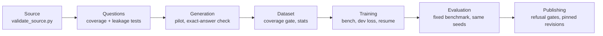

| layer | what is checked | how / command | pass criterion |
|---|---|---|---|
| source | row/column/match counts, date range, cumulative-score and ball arithmetic, known quirks | `python cricket/tools/validate_source.py <csv>` | exit 0; only the 4 documented notes (DATASET.md §8) |
| source (in pipeline) | row count before anything is built | `prepare.py` | stops unless 425,119 rows; records revision |
| questions | every source row covered; ids unique; train/test matches disjoint; benchmark only in test matches; original wording unchanged | local test of `build_full` (README §12.1) | 425,119 / 425,119 rows, 500,000 questions, disjoint, identical benchmark text |
| generation (wording) | accuracy, truncation, pass@4 per type on a stratified sample | `submit.sh pilot-full` | high accuracy, truncation ≈ 0, pass@4 = 100% for every type |
| generation (answers) | every kept trace finished and matches the exact answer | `cricket_qa.parse_answer`, `is_correct` | only verified traces enter the dataset |
| dataset | coverage of every source row; no pending / unsolved questions | `build_full_dataset.py` → `final/stats.json`, `uncovered_rows.jsonl`, `retry.jsonl` | uncovered = 0, unsolved = 0 |
| publishing (data) | coverage before upload | `push_full_dataset.py` | refuses if any source row is uncovered |
| training (config) | throughput and memory of candidate settings on real rows | `submit.sh bench` (1 node, 30 steps each) | no OOM on the longest batch; rows/s meets the time budget |
| training (run) | loss curves, dev loss every `SAVE_STEPS`, clean deadline stops and resumes | `metrics.jsonl`, W&B, job logs (`resuming from the latest checkpoint`) | loss decreasing, no NaN, `train_result.json` written once |
| training (hardware) | GPU utilization, memory, power, IB traffic on all nodes | `bash tools/measure_job.sh <job> 60` | GPUs busy, memory within 279.5 GiB, IB far below line rate |
| evaluation | base vs fine-tuned on the same fixed benchmark with the same sampling | `eval-base`, `eval-ft`, `finish_eval.py` | report generated; differences judged against the ±0.15-0.3 pt noise |
| publishing (model) | adapter config points at `Qwen/Qwen3.8-27B` (not a local path); card + eval report uploaded | `train.finalize` | push succeeds (HF validates the card metadata) |

### 6.1 Smoke test before a full run (≈ 30 min of cluster time)

```bash
C=/lustre/fsw/general_sa/bbalakreshna/clustercodes/code/cricket/submit.sh
python cricket/tools/validate_source.py <csv>                     # laptop or login node, 1 min
bash $C prepare-full                                              # 1 node, < 1 min
bash $C pilot-full                                                # 1 node, ~3 min: per-type table in the log
GEN_NAME=train-full EXTRA_ARGS="--max_steps 30 --train_limit 20000 --per_device_batch 8 --sampling group_by_length" \
  bash $C bench                                                   # 1 node, ~5 min: rows/s, OOM check
bash .../code/cricket/tools/triton_smoke.py                       # inside any new image: Triton compiles for sm_107
```

---

## 7. Code map

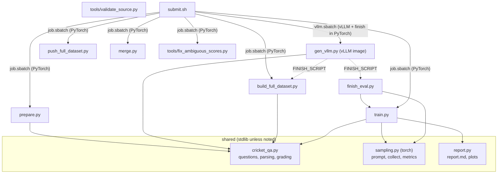

| file | container | role in the large pipeline |
|---|---|---|
| `config.env` | login node | account, partitions, paths, images, model revision, secrets file, repo ids |
| `submit.sh` | login node | stages `prepare-full`, `pilot-full`, `generate-full`, `retry-full`, `fix-ambiguous`, `push-full`, `bench`, `train-full` |
| `job.sbatch` / `vllm.sbatch` | SLURM | generic PyTorch job (python or torchrun) / one vLLM engine per GPU + finish script |
| `cricket_qa.py` | both | `build_full`, `row_questions`, `_ctx`, `parse_answer`, `is_correct` |
| `prepare.py` | PyTorch | download, verify 425,119 rows, write question sets |
| `gen_vllm.py` | vLLM | sampling worker (shard, resume, chunk, verify, append) |
| `build_full_dataset.py` | PyTorch | streaming selection, coverage, retry list, stats, W&B datagen summary |
| `push_full_dataset.py` | PyTorch | sharded upload with coverage gate and card |
| `train.py` | PyTorch (torchrun) | token cache, LoRA SFT, deadline/resume, completion guard, `finalize` (report, W&B, push) |
| `merge.py` | PyTorch (1 GPU) | merged checkpoint for vLLM |
| `finish_eval.py` / `report.py` | PyTorch | metrics, report, plots, W&B, adapter push |
| `tools/*` | various | `validate_source.py`, `fix_ambiguous_scores.py`, `measure_job.sh`, `collect_stats.sh`, `env_report.sh`, `triton_smoke.py` |

## 8. Failure modes and recovery

| failure | detection | recovery built in |
|---|---|---|
| job hits its time limit during generation | worker deadline log line; `pending > 0` in finish output | resubmit the same stage (any node count); already-sampled ids are skipped |
| question unsolved after k samples | `retry.jsonl` non-empty, push refused | `retry-full` (+ `fix-ambiguous` for runs ≤ wickets scores), new `--tag` |
| training chunk stops (time limit, pre-emption, node failure) | job state, `metrics.jsonl` stops | next chunk (`afterany`) resumes from the newest checkpoint (every `SAVE_STEPS`) |
| OOM on the longest batch | step-1 failure | benchmark first; longest batch is scheduled first |
| NCCL hang at uneven points | watchdog | rank-0 decisions broadcast; 2 h timeout; vLLM stages use no NCCL |
| image cannot compile Triton for Rubin | `LLVM ERROR: Cannot select ... shfl.sync.bfly` | use `dl/dgx/vllm:rubin-py3-devel`; check new images with `tools/triton_smoke.py` |
| queue gridlock | `squeue --start` N/A, rank, node-hours ahead | chunked short jobs, multi-partition submission (README §13.6) |
| duplicate bridge sessions | commands run twice | `bin/hecate-bridge` refuses to start a second instance |
| stale code on the cluster | different `md5sum` locally vs Lustre | `bin/hsync`, then compare `md5sum` before submitting |

## 9. Running it

```bash
C=/lustre/fsw/general_sa/bbalakreshna/clustercodes/code/cricket/submit.sh
# distillation (done once; resumable)
bash $C prepare-full && bash $C pilot-full
bash $C generate-full                                   # chain more with --dependency=afterany:<job> if needed
bash $C retry-full                                      # only if retry.jsonl is non-empty
bash $C push-full
# fine-tuning + evaluation + adapter push
PARTITION=batch-xdr,batch-spx GEN_NAME=train-full TRAIN_TIME=01:00:00 TRAIN_MIN=50 TRAIN_CHUNKS=7 SAVE_STEPS=100 \
  bash $C train-full
```
