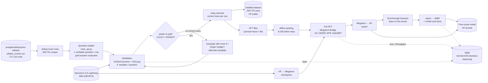
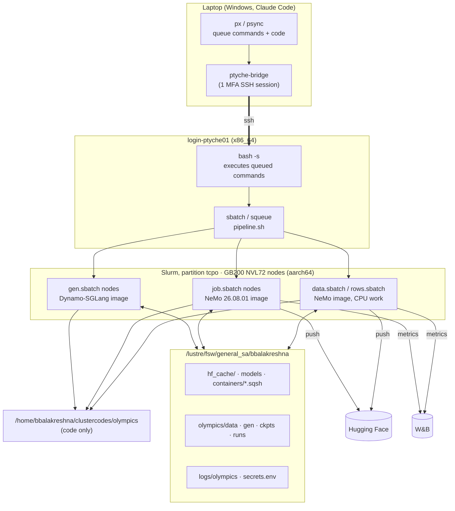
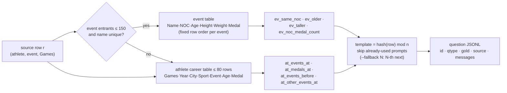
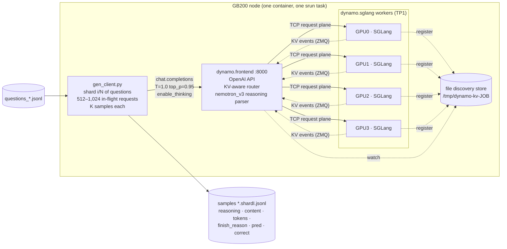
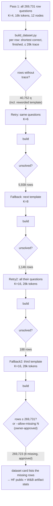
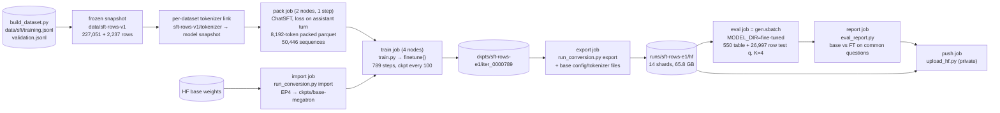
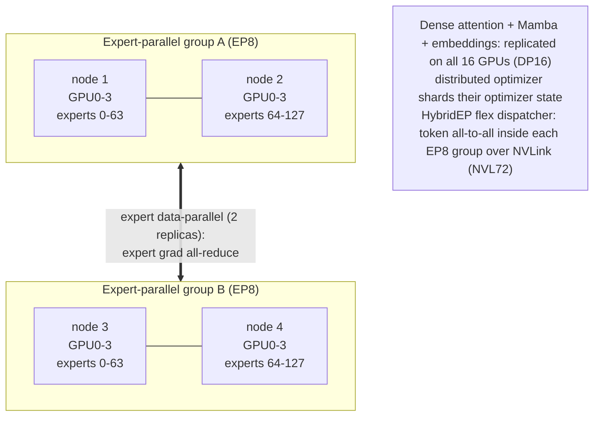
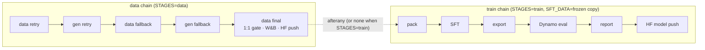

# Architecture: Olympics reasoning distillation + Nemotron SFT on Ptyche

How the pieces fit together: the end-to-end flow, the distillation flow (Dynamo + SGLang), the fine-tuning flow
(Megatron-Bridge on GB200), the job chain that runs it without supervision, and the data contracts between stages.
The numbers, results and reproduction commands are in [README.md](README.md).

---

## 1. End-to-end flow



The same base model is the **teacher** (served by Dynamo for distillation), the **student** (fine-tuned), and the
**baseline** (evaluated against the student). That makes this rejection-sampling self-distillation; see README §6.

---

## 2. System view: where things run



* **Code** lives in `~/clustercodes/olympics`, synced from the laptop's `ptyche/` folder by `psync`.
  **Everything large** (weights, HF cache, containers, data, samples, checkpoints, logs) lives on Lustre.
* The login node only submits jobs. It kills long CPU-heavy processes and cannot run `enroot import`, so all CPU
  work (question building, dataset builds) runs in the NeMo container on a compute node.
* Once a chain is submitted, it needs neither the laptop nor the bridge.

---

## 3. Distillation flow

### 3.1 Question construction



The gold answer is computed from the same table that goes into the prompt, so it is fully determined and can be
checked exactly. The split is by athlete (10 % test), matching the benchmark split.

### 3.2 One Dynamo deployment per node (`gen.sbatch`)



* **Workers:** each GPU holds a full copy of the 30B-A3B model (TP1), with about 8.7M tokens of KV and Mamba-state
  capacity. Settings follow the model card's Blackwell recipe: FlashInfer Mamba kernels, an FP16 SSM state with
  stochastic rounding, and a decode CUDA graph sized for up to 256 batched requests.
* **Router:** the KV-aware router sends questions that share a table prefix (the same event) to the worker that
  already has that prefix cached.
* **No etcd or NATS:** discovery uses a node-local file store and requests go over TCP, so every node is a
  self-contained deployment, and N nodes are just N independent shards.
* **Resumable:** the client appends one JSON line per sample and skips `(id, sample)` pairs already present.
* **Throughput:** about 31.7k output tokens/s per node on long runs (12 nodes: 380k tok/s, about 156 requests/s); startup takes about 3.5 min. Per-node tables are in README §3.4.

### 3.3 Coverage loop (rejection sampling to ≥ 1:1)



Every build merges **all** sample files (`rows*.jsonl`) by question id and every question file
(`questions_rows_{train,test,fallback*}.jsonl`) by source row, so later passes only add to earlier ones.

---

## 4. Fine-tuning flow

### 4.1 Stages



* **Why a frozen snapshot:** training started while the last coverage passes were still running. Training reads a
  copy that cannot change underneath it, and its stats travel with it into the model card.
* **Why a per-dataset tokenizer link:** Megatron-Bridge names its packed cache `<tokenizer>_pad_seq_to_mult2_sft_<hash>`
  and the hash does not depend on the data. Pointing the packer at `<data>/tokenizer` gives every dataset its own
  cache.
* **Same harness for evaluation:** the fine-tuned export is served by exactly the same Dynamo deployment and
  sampling settings that produced the base model's samples, so the comparison is like for like.

### 4.2 Multi-GPU layout (16 GB200, TP1 · EP8 · DP16)



* Each of the 128 experts lives on exactly one GPU per EP group (16 experts per GPU). Tokens are routed to their
  top-k experts by the HybridEP dispatcher, which is designed for GB200 NVL72's NVLink domain.
* **Memory:** at EP4 on a single node, each GPU had to hold 32 experts plus their FP32 optimizer state, and ran
  out of memory at 171 of 184 GB. EP8 halves that; peak was 97–122 GB.
* Selective activation recompute (`moe, layernorm, core_attn, mlp`) trades extra compute for activation
  memory at 8k sequence length.
* Each step processes 64 packed sequences of 8,192 tokens, about 0.5M tokens, at about 3.3 s per step and
  ~270 TFLOP/s per GPU.

---

## 5. Unattended execution: the Slurm chain

`pipeline.sh` submits every stage with `--dependency=afterok:<previous>`, so a failure cancels everything after it
and nothing runs on bad inputs. The one exception: packing waits with `afterany` on the final data build, so a
coverage gate that refuses the HF push does not block training.



Switches: `FROM=retry2` resumes the data chain at the second retry; `STAGES=data|train|all` picks a chain;
`SFT_DATA` selects the frozen training copy. Every job logs to `$LOG_DIR/olympics/<job-name>-<jobid>.out`; the
chain itself appends to `pipeline-<run>.log`.

**As actually executed on 2026-10-09:** the data chain retry → fallback → final ended 1,146 rows short. Retry2
and fallback2 were then added (still 8 short), and the owner approved a final push with `--allow-missing 8`. The
train chain ran in parallel from the 99.58 % snapshot after two packing restarts: one for the stale-cache bug, one
for the 1 h time limit.

---

## 6. Data contracts

| Stage output | Format (one JSON object per line) |
|---|---|
| Question (`data/questions_*.jsonl`) | `id` (`row<idx>-<qtype>[-fb[N]]`), `qtype`, `answer_kind`, `gold`, `source` {`row_index`, `athlete_id`, `name`, `games`, `event`, `noc`}, `messages` [system, user] |
| Sample (`gen/<tag>/<split>.shard<i>.jsonl`) | `id`, `qtype`, `sample`, `gold`, `reasoning`, `content`, `finish_reason`, `completion_tokens`, `prompt_tokens`, `pred`, `correct` |
| Published row (`hf/data/{train,test}.jsonl`) | `id` (`row<idx>`), `source_row_index`, `question_id`, `qtype`, athlete/Games/event/NOC metadata, `question`, `answer`, `reasoning`, `response`, `reasoning_tokens`, `prompt_tokens`, `messages` |
| SFT row (`data/sft*/training.jsonl`) | `messages`: system · user · assistant {`reasoning_content`, `content`} |
| Eval report (`runs/<run>/eval/report.json`) | per benchmark × {base, finetuned} × qtype: `samples`, `pass@1`, `mean_tokens`, `truncated_pct`; `questions_compared` |

**Grading** (`olympics_qa.is_correct`): the answer is taken from the last `Final answer:` after the reasoning
block. Integers must match exactly, 1-decimal answers within 0.05, and names or NOC codes are compared
case- and whitespace-normalised. Truncated samples never count as correct.

## 7. Storage layout (`$LUSTRE_DIR/olympics`)

```
data/      questions_*.jsonl, rows_stats.json, rows_dataset_stats.json, unsolved_rows.jsonl
           sft/ (latest build) · sft-rows-v1/ (frozen training copy + its packed cache) · sft-bench/ · hf/ (pushed files)
gen/       full/ (9.8k table set) · rows/ (all row passes) · eval-sft-rows-e1/ · smoke*/   + logs/node*.{frontend,worker*,client-*}.log
ckpts/     base-megatron/ (imported base) · sft-rows-e1/ (iter_0000700, iter_0000789; 859 GB with optimizer state)
runs/      sft-rows-e1/hf (exported model) · eval/report.json · card_facts.json
```
